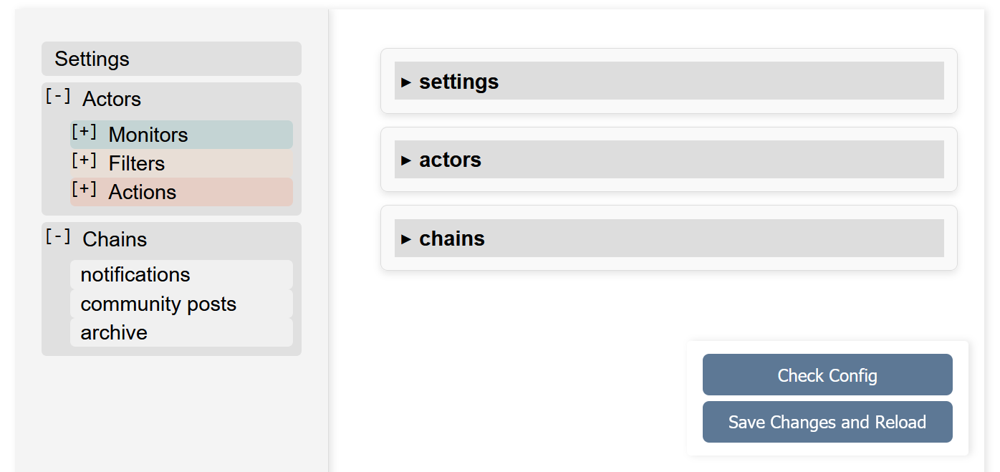
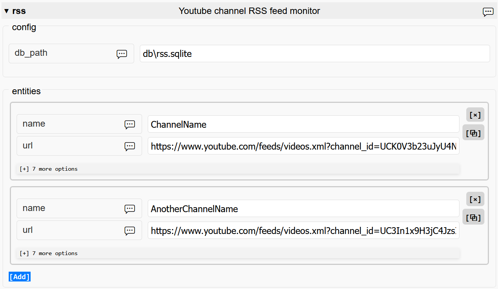
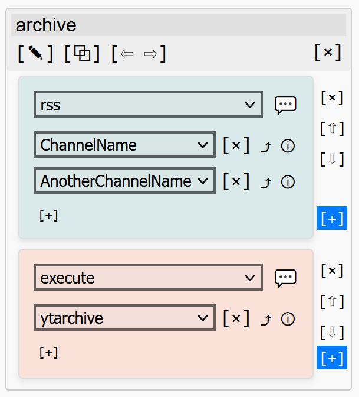

## avtdl - Web interface

When avtdl is running, web interface is available on <http://localhost:8080>, unless different port is specified in
configuration. It makes managing complex configuration easier at the expense of flexibility YAML provides.

### Configuration editor

Web interface follows [configuration file structure](https://github.com/15532th/avtdl#configuration-file-format), with
application-wide options in `Settings`, producers and consumers entities defined in `Actors` and then combined
in `Chains` sections.

<figure>
<p align="center" width="100%">  

</p>
</figure>

Configuration file is saved under the same name it was loaded on the application startup. Backups of a few most recent
versions are made by appending a number to the name (`config.yml` would be moved to `config.yml.0` and so on).

When existing configuration file is loaded into the web interface, edited and stored back on disk, it will preserve defined functionality, but not formatting. Parser tries to preserve comments, parentheses, flow style, but indentation levels are normalized, options with default values are omitted, the `defaults` sections are expanded into corresponding entities and then removed.

### Actors

Individual plugins that produce, filter or process, and consume records are grouped by type into `Monitors`, `Filters` and `Actions` subsections.

Entities are represented as a set of input fields grouped together:

<figure>
<p align="center" width="100%">  

</p>
</figure>


Each option has a tooltip with option description, however, it does not include details, described in the [common options](https://github.com/15532th/avtdl#common-options) section of the README.

### Chains

Single chain is represented by a vertical stack of `cards`, each defining one or more entities of a single actor. Records move top to bottom, from every entity of one `card` to every entity of the next one. 

The following picture shows a chain named "archive". It references two entities of the [rss](https://github.com/15532th/avtdl/blob/master/PLUGINS.md#rss---youtube-channel-rss-feed-monitor) monitor, "ChannelName" and "AnotherChannelName". Records, produced by these entities, are passed into the "ytachive" entity of the [execute](https://github.com/15532th/avtdl/blob/master/PLUGINS.md#execute---run-pre-defined-shell-command) action.

<figure>
<p align="center" width="100%">

</p>
</figure>

Corresponding fragment of the YAML config:

```yaml
chains:
  "archive":
    - rss:
        - "ChannelName"
        - "AnotherChannelName"
    - execute:
        - ytarchive
```

Drop-down selectors with entities names are populated with entities names that are currently present in the `Actors` section. When entity is renamed, the change is reflected in all chains referencing it, and when entity is deleted, it gets removed from all chains.

For convenience, it is possible to reorder cards within a chain by using arrow buttons (`⇧` and `⇩`). Chains themselves can also be repositioned (with `⇦` and `⇨`), though their order is purely cosmetic. "Go to entity definition" button (`⤴`) allows jumping from a chain using entity to the entity configuration in `Actors` section.


### Applying changes

When "Save Changes and Reload" button is pressed, current configuration is validated and written into the configuration file. The application will then interrupt all currently running tasks (including subprocesses started by [execute](https://github.com/15532th/avtdl/blob/master/PLUGINS.md#execute---run-pre-defined-shell-command) plugin), shut down web interface server, and restart, loading new configuration.

Note that restarting normally takes at least a few seconds, and web page will reload after startup is completed. Any changes made in the configuration editor before restart was completed are likely to be lost.

If configuration submitted for saving contains errors (duplicated chains or entities names, invalid values and so on), the configuration file is not overwritten and restart is not performed.
