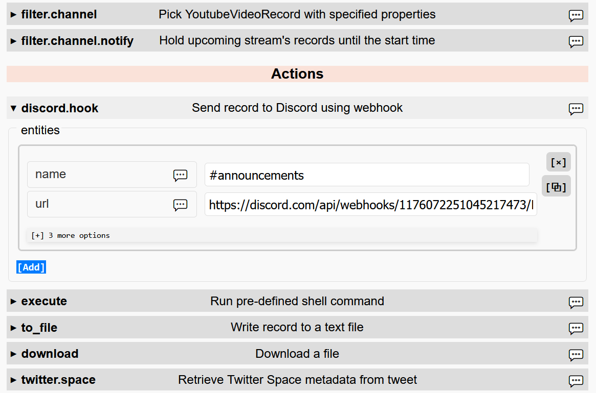

## avtdl - Web interface

When avtdl is running, web interface is available on <http://localhost:8080>, unless different port is specified in
configuration. It makes configuration process more grafical at the expense of flexibility YAML provides.

When existing configuration file is loaded into the web interface, edited and stored back on disk, it will preserve
defined functionality, but not formatting. Parser tries to preserve comments, parenthesses, flow style, but indentation
levels are normalized, options with default values are omitted, the `defaults` sections are expanded into corresponding
entities and then removed.

### Main window

Web interface follows [configuration file structure](https://github.com/15532th/avtdl#configuration-file-format), with
application-wide options in `Settings`, producers and consumers entities defined in `Actors` and then combined together
in `Chains` sections.

<figure>

<figcaption>
Interface of the configuration editor
</figcaption>
</figure>

Configuration file is saved under the same name it was loaded on the application startup. Backups of a few most recent
versions are made by appending a number to the name (`config.yml` would be moved to `config.yml.0` and so on).

### Actors

<figure>

<figcaption>
discord.hook entity "#announcements" in the Actors section
</figcaption>
</figure>

